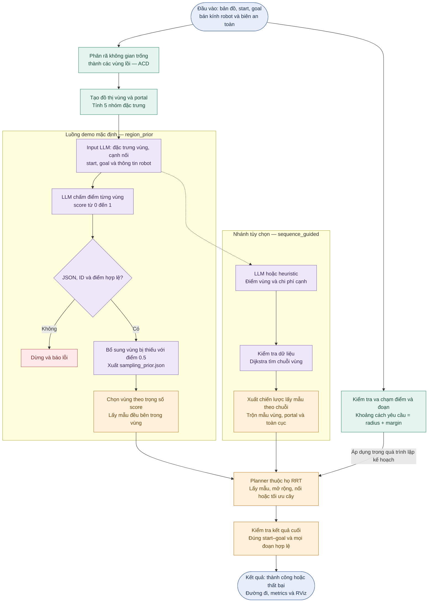

# Flowchart DACN-main

Đối chiếu bản DACN-main ngày 03/10/2026. Sơ đồ thể hiện luồng demo mặc định và nhánh lập kế hoạch theo chuỗi vùng.

## Phạm vi

Luồng demo hiện tại dùng `region_prior`, gọi OpenRouter qua `llm_region_prior.py`. Dijkstra không nằm trong luồng mặc định này. Nhánh `sequence_guided` là một chế độ khác được repo hỗ trợ; cần tạo và cấu hình strategy riêng. Repo còn hỗ trợ `none` và `corridor`, được lược bớt để sơ đồ tập trung vào LLM.

## Giải thích các khối

- Input: biên workspace, polygon obstacle, start, goal, robot_radius, safety_margin.
- ACD: phân rã không gian trống thành các polygon lồi. Pipeline cũng có thể nhận trực tiếp dữ liệu các vùng lồi.
- Năm nhóm đặc trưng: kích thước, hình dạng, clearance, kết nối/conductance và portal. Portal là đặc trưng của quan hệ giữa hai vùng. Start, goal và thông tin robot là ngữ cảnh cho LLM.
- LLM chỉ chấm điểm để hướng dẫn lấy mẫu. LLM không sinh đường đi liên tục hay quyết định tính an toàn của đường đi.
- Validation: từ chối JSON sai, ID lạ/trùng hoặc điểm không hữu hạn/ngoài [0,1]. Vùng bị bỏ sót được gán 0.5 khi phản hồi vẫn có điểm hợp lệ. Phản hồi không có điểm sử dụng được sẽ bị từ chối.
- Region prior: C++ chuẩn hóa trọng số ngầm qua discrete_distribution, tương đương P(R_i) = score_i / Σ score_j. Chọn tam giác theo diện tích rồi lấy mẫu đều bên trong tam giác, do đó mẫu đều theo diện tích trong vùng đã chọn. Phải có ít nhất một score dương; tất cả bằng 0 bị từ chối ở bước nạp sampler.
- Không gán tỉ lệ 80% guided / 20% global cho region_prior. Tỉ lệ này là mặc định của sequence_guided. Trong nhánh guided của sequence_guided, xác suất chọn portal mặc định là 20% nếu có portal.
- Informed RRT*: khi cấu hình bật ràng buộc informed, sau nghiệm đầu tiên prior được giới hạn bởi ellipsoid cải thiện nghiệm.
- Planner: RRT, RRT*, RRT#, BRRT, BRRT* hoặc Informed RRT*. Có thể chạy tất cả để so sánh; các planner không chạy nối tiếp như các bước của một thuật toán.
- Va chạm: robot được biểu diễn bằng một điểm trong configuration space; kiểm tra khoảng cách tương đương giãn obstacle và co workspace theo radius + margin. Code không cần tạo polygon offset mới. Kiểm tra này áp dụng cho điểm và đoạn, trong lập kế hoạch và trên đường cuối.
- Trạng thái kết quả bao gồm thất bại khi không có đường hợp lệ. Điều kiện dừng/tối ưu phụ thuộc planner và ngân sách; sơ đồ tổng quan không giả định mọi planner dừng ngay ở nghiệm đầu tiên.

## Dẫn chứng mã nguồn

| Thành phần | Vị trí trong DACN-main |
|---|---|
| Chế độ demo mặc định | `sampling-based-path-finding-main/src/path_finder/launch/demo.launch:5` |
| Map → ACD → graph | `convex-region-graph/build_graph.py:624` |
| Graph và portal | `convex-region-graph/build_graph.py:647` |
| Input cho LLM | `convex-region-graph/llm_weight_provider.py:66` |
| Gọi LLM chấm vùng | `convex-region-graph/llm_region_prior.py:44` |
| Kiểm tra điểm vùng | `convex-region-graph/llm_region_prior.py:81` |
| Xuất prior sang C++ | `convex-region-graph/export_sampling_prior.py:19` |
| Chọn chế độ lấy mẫu | `sampling-based-path-finding-main/src/path_finder/include/path_finder/sampler.h:86` |
| Phân phối chọn vùng theo score | `sampling-based-path-finding-main/src/path_finder/include/path_finder/sampler.h:237` |
| Lấy mẫu trong vùng | `sampling-based-path-finding-main/src/path_finder/include/path_finder/sampler.h:557` |
| Nhánh điểm vùng + chi phí cạnh → Dijkstra | `convex-region-graph/llm_region_planner.py:278` |
| Bán kính và margin | `sampling-based-path-finding-main/src/occ_grid/include/occ_grid/map_geometry.h:38` |
| Kiểm tra đường cuối, ví dụ RRT | `sampling-based-path-finding-main/src/path_finder/src/test_planner.cpp:324` |
