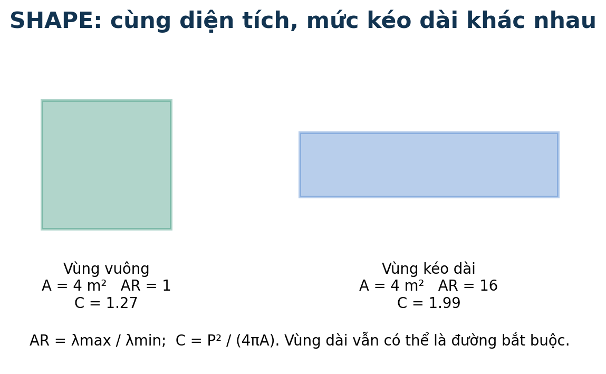
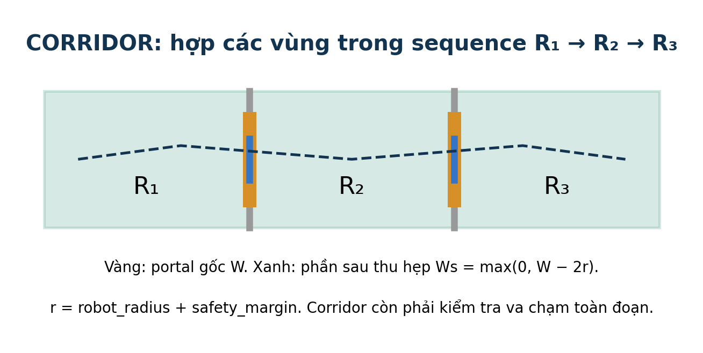
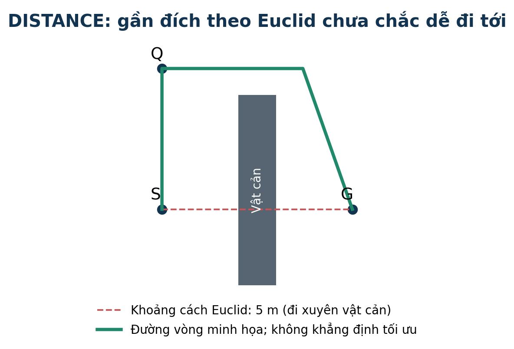
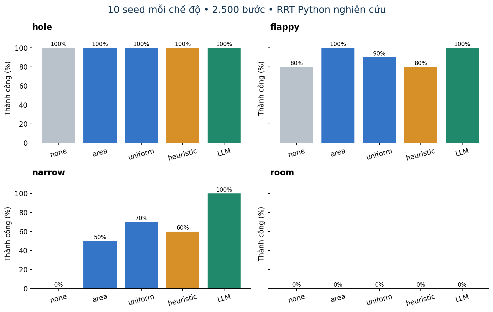
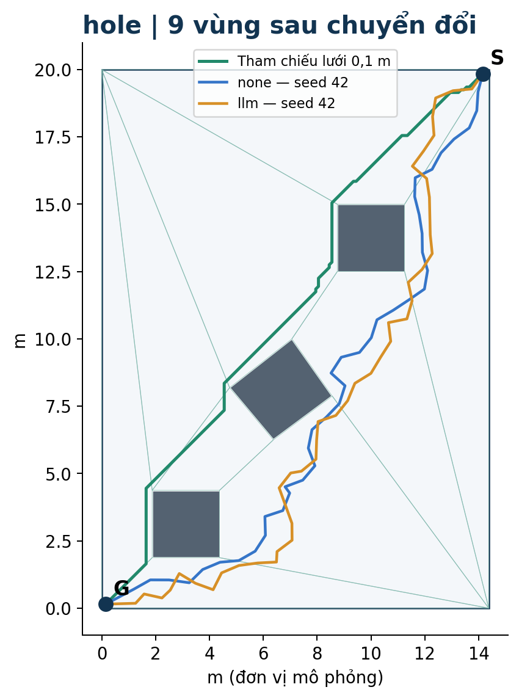
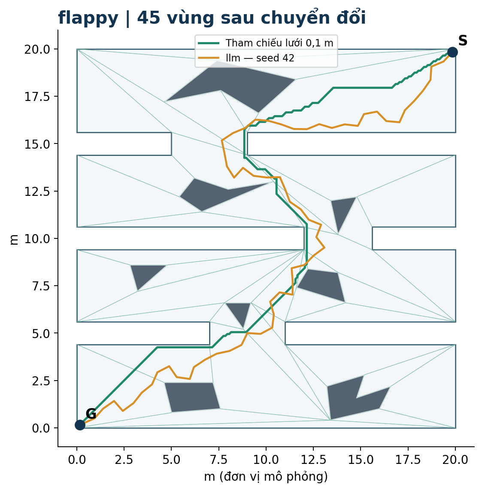
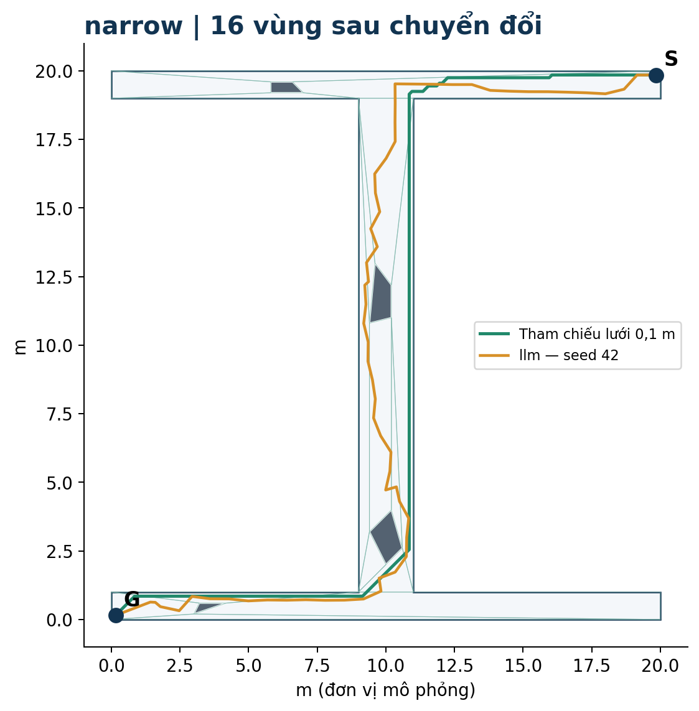
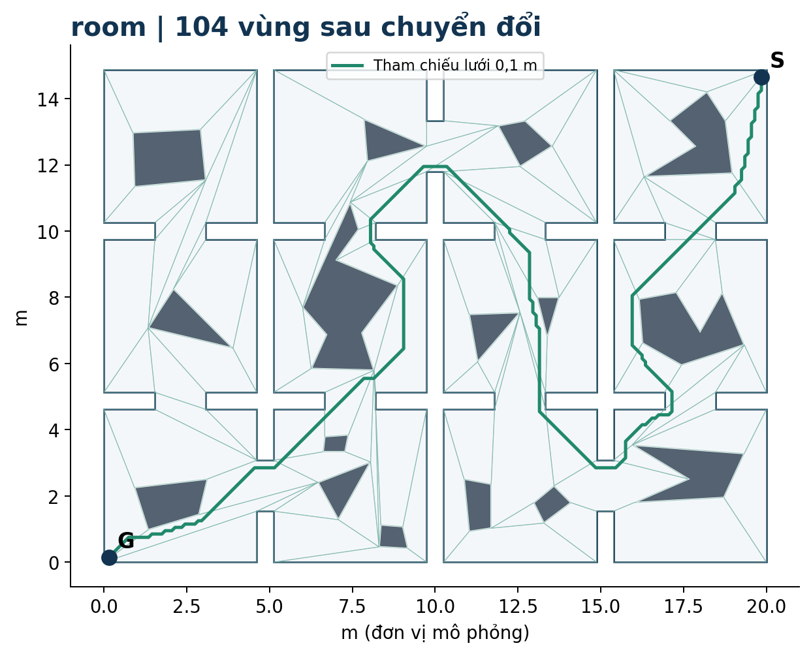

# Đánh giá LLM-guided RRT trên GCR-Dataset

> Cập nhật sau thí nghiệm Python: [benchmark ROS/C++ đã hoàn tất 720 lượt](../ros-gcr-benchmark/REPORT.md). Nội dung dưới đây là báo cáo giai đoạn Python trước khi chạy ROS.

Bản kết quả hoàn tất ngày 08/10/2026. Dùng dữ liệu người dùng cung cấp và code DACN-main; mọi con số dưới đây lấy từ JSON đã lưu.

## Phạm vi và kết quả chính

Đã chuyển đổi cả 4 map, chạy **480 lượt chính** (4 map × 12 chế độ × 10 seed), **30 lượt bổ sung** ở ngân sách cao hơn và **2 pilot gọi lại API thật**. Tổng cộng 512 lượt RRT. Đã tự vẽ 3 hình giải thích và 4 hình bản đồ.

Đây là **RRT Python nghiên cứu, không phải benchmark sáu planner ROS/C++**. Docker trên máy chưa hoạt động nên chưa xác nhận kết quả trong ROS. Phần cập nhật động hiện là prototype Python.

LLM không tốt hơn trong mọi trường hợp: `narrow` đạt 10/10 so với `none` 0/10 ở 2.500 bước, nhưng `hole` có đường LLM trung bình dài hơn heuristic. `room` thất bại toàn bộ ở ngân sách này; tăng lên 10.000 bước cho kết quả khác. Các lần dùng cùng một prior LLM cố định, chưa đo biến thiên giữa các lần model sinh điểm.

## 1. Dataset, đơn vị và điều kiện kiểm tra

Nguồn là bốn file `.poly`. Graph gốc có cạnh shared_length=0; các cạnh chỉ chạm điểm không tạo cửa cho robot có kích thước. Do chưa có mã định nghĩa d_shape, d_corridor, d_distance, d_trav và cost của dataset, báo cáo không suy đoán công thức các trường đó. Đồ thị được dựng lại từ hình học bằng DACN.

Giả định mô phỏng: cạnh dài nhất mỗi map = 20 m; bán kính robot 0,10 m; biên an toàn 0,05 m. Đây chưa phải kích thước vật lý do anh Huy xác nhận. Start/goal được chọn xa nhau trong thành phần liên thông an toàn lớn nhất, giữ nguyên giữa các chế độ. Metadata lưu phép scale, nguồn, hash và điểm đầu/cuối.

Robot được kiểm tra bằng tâm điểm với khoảng cách tối thiểu **0,15 m tới vật cản và biên ngoài** trên toàn đoạn chuyển động; tương đương điều kiện tránh vật cản đã nở cho robot đĩa trong kiểm tra này. Không cộng bán kính lần thứ hai vào hình học đã nở. Biên phân rã vùng không phải vật cản.

Map | Graph gốc: vùng/cạnh | Cạnh gốc W=0 | Graph dựng lại: vùng/cạnh có hướng | Cách phân rã
--- | --- | --- | --- | ---
hole | 9/34 | 12 | 9/22 | repository_acd
flappy | 35/128 | 42 | 45/104 | repository_acd
narrow | 18/70 | 24 | 16/38 | constrained_delaunay_plus_repository_convex_merge
room | 83/306 | 98 | 104/238 | repository_acd

Map `narrow` làm ACD cũ báo lỗi, nên importer dùng constrained Delaunay rồi ghép vùng lồi bằng hàm DACN. Đã kiểm tra độ phủ và chồng lấn. Lưới 0,2 m bỏ sót lối nối của narrow; lưới chính dùng 0,1 m và đã đối chiếu thêm 0,05 m. Các thành phần liên thông được tính trên lưới, không phải chứng minh liên thông liên tục.

## 2. Shape, corridor và distance

### Shape — hình dạng của một vùng

AR = λmax/λmin, với hai eigenvalue của covariance cho phân bố **đều theo diện tích** polygon. Không lấy căn và không dùng covariance của riêng các đỉnh. Compactness C = P²/(4πA). AR và C càng lớn thường biểu thị vùng kéo dài/kém gọn. Trong heuristic, chuẩn hóa từng đặc trưng trên map rồi tính Qshape = 1 − (norm(AR)+norm(C))/2; đóng góp tối đa 0,08 điểm.

Ví dụ hai hình cùng diện tích 4 m²: vuông 2×2 có AR=1, C≈1,27; chữ nhật 4×1 có AR=16, C≈1,99. Vùng vuông thuận lợi hơn theo riêng shape, nhưng vùng dài vẫn có thể là lối đi bắt buộc.

### Corridor — hành lang tạo bởi chuỗi vùng

Với sequence R1→R2→…→Rk, corridor Ω = R1 ∪ R2 ∪ … ∪ Rk. Hai vùng liên tiếp có portal chung dài W. Code thu hai đầu portal một khoảng r = robot_radius+safety_margin, nên Ws=max(0,W−2r). Conductance vùng = ΣW/P; safe_conductance dùng Ws. Đặc trưng cạnh Ts=Ws×min(CL_i,CL_j), đơn vị m², không phải xác suất an toàn.

Ví dụ W=1,2 m, r=0,15 m thì Ws=0,9 m. Nếu mean clearance hai bên 0,5 và 0,3 m thì Ts=0,27 m². Corridor không phải một con số shape và không đồng nghĩa clearance; nó là tập không gian cho phép planner hoạt động. Cửa rộng tăng lựa chọn chuyển tiếp, nhưng vẫn phải kiểm tra va chạm thực tế.

### Distance — gần đích và chi phí đi thực tế

Heuristic vùng dùng d_i=||centroid_i−centroid_goal|| và D=||centroid_start−centroid_goal||. Progress=clip(1−d_i/D,0,1); detour=clip((d_i−D)/D,0,1). Hai đóng góp là +0,24×progress và −0,12×detour. Đây là khoảng cách Euclid giữa centroid, không phải chiều dài đường tránh vật cản và không phải khoảng cách từ node cây hiện tại.

Ví dụ D=10 m: d_i=4 m cho progress=0,6, cộng 0,144; d_i=14 m cho detour=0,4, trừ 0,048. Có thể phải đi xa goal trước để vòng qua tường. Vì vậy distance cần được xét cùng topology, portal và vùng bắt buộc.

## 3. Kiểm tra tiêu chí và cách chấm điểm

LLM nhận các vùng/centroid, diện tích/đường kính, shape, clearance, degree/conductance, cạnh có hướng và các độ rộng portal, cùng start/goal và thông số robot. Bản thí nghiệm bỏ thông tin lặp, làm tròn số 5 chữ số thập phân và yêu cầu trả `region_scores` đủ mọi ID. Khi cập nhật động có thêm số node được chấp nhận theo vùng, tập vùng đã khám phá, bước lặp, prior hiện tại và độ dài đường tốt nhất nếu có.

**Heuristic có công thức cố định; LLM đánh giá theo prompt định tính.** Không trình bày công thức heuristic như nội suy nội bộ của LLM. Cả hai trả điểm [0,1]. Sampler chọn P(R_i)=s_i/Σs_j, sau đó lấy mẫu đều trong vùng; điểm 0,8 không có nghĩa xác suất thành công 80%. Ví dụ điểm 0,8; 0,4; 0,2 tương ứng xác suất chọn vùng khoảng 57,1%; 28,6%; 14,3%.

Chuẩn hóa min–max theo từng map; thiếu dữ liệu hoặc cả map có cùng giá trị thì dùng 0,5 trung tính. Tổng đóng góp được chặn [0,1]. Các trọng số hiện là thiết kế heuristic, chưa được học hay tối ưu thống kê.

Thành phần heuristic vùng | Đóng góp
--- | ---
Điểm nền | +0,20
Tiến gần goal | +0,24 × progress
Số kết nối giữ lại (safe_degree) | +0,14 × norm
Mean clearance | +0,14 × norm
Diện tích | +0,08 × norm
Shape | +0,08 × Qshape
Detour | −0,12 × detour
Vùng bắt buộc trong topology | +0,20
Vùng start hoặc goal | +0,12

Năm nhóm đặc trưng gồm Size, Shape, Clearance, Connectivity/Conductance và Portal. Công thức heuristic vùng hiện chỉ dùng một phần: area thay vì cả diameter; safe_degree thay vì trực tiếp conductance; portal chủ yếu vào cost cạnh. Không nên nói cả năm nhóm đều có một trọng số độc lập trong điểm vùng.

Cost cạnh heuristic = clip(0,18 + 0,22·norm(length) + 0,15·(1−norm(W)) + 0,15·(1−norm(Ws)) + 0,12·(1−norm(Ts)) − 0,10·edge_progress + 0,08·max(−edge_progress,0) + 0,10·(1−score_target), 0,01, 1). length là khoảng cách centroid hai vùng; edge_progress=(d_source−d_target)/max(d_source,d_target,ε). Chi phí này không có đơn vị mét và chưa được hiệu chỉnh để tương đương chiều dài đường.

Vùng | Heuristic | LLM | A (m²) | AR | CL (m) | safe_degree | Cộng bottleneck
--- | --- | --- | --- | --- | --- | --- | ---
flappy/C16 | 0.307 | 0.010 | 6.000 | 871.36 | 0.185 | 2 | 0.00
flappy/C8 | 0.816 | 0.720 | 10.740 | 23.48 | 0.926 | 5 | 0.20
narrow/C5 | 0.872 | 0.760 | 13.620 | 302.55 | 0.295 | 3 | 0.20

Ví dụ tính đầy đủ narrow/C5: base(0.2000) + goal_progress(0.1208) + connectivity(0.1400) + clearance(0.0554) + size(0.0800) + shape(0.0753) + required_bottleneck(0.2000) = 0.8715. Vùng này có thêm 0,20 vì bỏ nó sẽ làm mất đường start→goal đang có. Điểm LLM khác vì không bị ràng buộc bởi trọng số heuristic. Code đã sửa trường hợp đồ thị vốn không có đường: không được đánh dấu mọi vùng trung gian là bottleneck.

### Đối chiếu từng nhóm bằng bỏ một thành phần (ablation)

Mỗi ô là số lần thành công/10; chỉ bỏ thành phần được ghi khỏi điểm heuristic, giữ phần còn lại và cùng ngân sách.

Chế độ | hole | flappy | narrow | room
--- | --- | --- | --- | ---
heuristic | 10/10 | 8/10 | 6/10 | 0/10
heuristic_no_shape | 10/10 | 10/10 | 6/10 | 0/10
heuristic_no_distance | 10/10 | 9/10 | 2/10 | 0/10
heuristic_no_clearance | 10/10 | 10/10 | 6/10 | 0/10
heuristic_no_connectivity | 10/10 | 10/10 | 6/10 | 0/10

Trong narrow, bỏ distance làm thành công giảm từ 6/10 xuống 2/10; trong flappy, bỏ một số thành phần lại tăng thành công. Đây là bằng chứng trọng số chưa tốt đồng đều trên mọi map, không phải bằng chứng một tiêu chí luôn vô ích. Bỏ connectivity ở đây bỏ cả safe_degree và thưởng bottleneck; chưa tách riêng hai hiệu ứng. Với 10 seed và một prior/model/map, chưa đủ kết luận thống kê tổng quát.

## 4. Sequence hợp lệ và hành lang chứa đường tốt

Kiểm tra ba tầng: (1) đúng ID/start/goal và cạnh có hướng; (2) tìm được đường tránh vật cản trong hợp các vùng; (3) độ dài tối ưu trong corridor có bằng tối ưu trên toàn **cùng lưới** không. Kiểm tra union không bắt đường phải đi đúng thứ tự sequence. Lưới là 8 hướng, không chứng minh tối ưu liên tục.

Map | Cách chọn sequence | Topo hợp lệ | Đường trong corridor, h=0,1 | L toàn map (m) | L corridor (m) | Chênh (%)
--- | --- | --- | --- | --- | --- | ---
hole | heuristic | True | True | 25.97 | 25.97 | 0.00
hole | LLM vùng + cost hình học | True | True | 25.97 | 25.97 | 0.00
flappy | heuristic | True | True | 37.27 | 39.03 | 4.71
flappy | LLM vùng + cost hình học | True | True | 37.27 | 39.03 | 4.71
narrow | heuristic | True | False | 37.58 | — | —
narrow | LLM vùng + cost hình học | True | False | 37.58 | — | —
room | heuristic | True | False | 45.26 | — | —
room | LLM vùng + cost hình học | True | False | 45.26 | — | —

`hole` giữ được tối ưu lưới dù chính đường tham chiếu được Dijkstra chọn có một phần ngoài corridor: có đường khác đồng tối ưu. `flappy` có corridor hợp lệ nhưng dài hơn khoảng 4,7%. `narrow` và `room` chưa tìm được đường trong corridor đã chọn trên cả lưới 0,1 m và kiểm tra 0,05 m cho sequence heuristic. Điều này không chứng minh không có đường liên tục; nó đủ để không công nhận sequence là đã được xác thực về hình học.

Một phát hiện cụ thể: trong narrow, trên safe_portal C5→C11, chỉ 23/101 điểm kiểm tra đạt clearance 0,15 m. Việc thu hai đầu portal không bảo đảm toàn phần còn lại cách xa mọi vật cản. Đây là spot check, không phải chứng nhận toàn portal. RRT trong thí nghiệm luôn kiểm tra từng đoạn chính xác, nên không sử dụng nhãn “safe” làm thay thế collision check. Nên giữ nhánh lấy mẫu ngoài corridor hoặc kiểm tra khả thi trước khi khóa planner vào một sequence.

## 5. Kết quả lấy mẫu và cơ chế giảm điểm

12 chế độ × 10 seed (42–51) × 2.500 bước. Bước mở rộng 0,7 m; nối goal khi cách ≤1,4 m; RRT không rewiring, không goal bias. Chạy đủ ngân sách và giữ kết nối goal tốt nhất. Cùng seed không có nghĩa cùng mọi mẫu ngẫu nhiên. Độ dài trung bình chỉ tính các lần thành công, nên cần đọc cùng tỷ lệ thành công.

Map | Chế độ | Thành công | L TB (m) | SD (m) | Bước tìm đường đầu TB
--- | --- | --- | --- | --- | ---
hole | heuristic | 10/10 | 30.81 | 2.27 | 501
hole | llm | 10/10 | 31.65 | 1.47 | 457
hole | none | 10/10 | 31.18 | 2.24 | 738
hole | region_area | 10/10 | 30.89 | 1.66 | 554
hole | region_uniform | 10/10 | 31.31 | 2.08 | 477
flappy | heuristic | 8/10 | 47.55 | 4.23 | 1567
flappy | llm | 10/10 | 45.23 | 2.56 | 1500
flappy | none | 8/10 | 46.45 | 2.32 | 1618
flappy | region_area | 10/10 | 46.04 | 3.10 | 1335
flappy | region_uniform | 9/10 | 47.82 | 3.19 | 1577
narrow | heuristic | 6/10 | 40.65 | 1.23 | 1636
narrow | llm | 10/10 | 40.40 | 1.00 | 1530
narrow | none | 0/10 | — | — | —
narrow | region_area | 5/10 | 41.49 | 0.97 | 1222
narrow | region_uniform | 7/10 | 40.21 | 0.63 | 1460
room | heuristic | 0/10 | — | — | —
room | llm | 0/10 | — | — | —
room | none | 0/10 | — | — | —
room | region_area | 0/10 | — | — | —
room | region_uniform | 0/10 | — | — | —

`none` lấy mẫu bounding box; `region_area` chọn vùng theo diện tích (đều trên không gian tự do phân rã); `region_uniform` cho mọi vùng cùng điểm. Cả hai đối chứng không dùng LLM. Flappy có region_area 10/10 tương tự LLM; vì thế không thể gán toàn bộ chênh lệch với none cho suy luận LLM. Narrow vẫn cho thấy prior LLM tốt hơn các đối chứng về tỷ lệ thành công ở ngân sách này. Chi phí lấy điểm LLM ban đầu không nằm trong thời gian planner.

### Giảm điểm theo số node được thêm

Sau mỗi 20 node **được chấp nhận trong chính vùng i**, cập nhật s_i=max(min(0,05,s_i_initial),(1−α)s_i). Mẫu bị từ chối không làm giảm điểm. Ví dụ s=0,8, α=15%: sau 20 node còn 0,68; sau 40 node còn 0,578. Xác suất lấy mẫu được chuẩn hóa lại nên giảm điểm một vùng làm tỷ trọng vùng khác tăng. Khi prior mới được nhận, áp lại decay theo tổng số node đã thêm.

Mức giảm | hole | flappy | narrow | room
--- | --- | --- | --- | ---
llm | 10/10 | 10/10 | 10/10 | 0/10
llm_decay_5pct | 10/10 | 10/10 | 7/10 | 0/10
llm_decay_15pct | 10/10 | 10/10 | 8/10 | 0/10
llm_decay_30pct | 10/10 | 10/10 | 10/10 | 0/10

Chưa có mức giảm thắng nhất quán: narrow giảm 5% hoặc 15% làm tỷ lệ thành công kém hơn prior tĩnh; flappy giữ 10/10 nhưng đường trung bình dài hơn. Chưa nên bật decay mặc định. Cần kiểm tra thêm cơ chế chỉ giảm ở vùng không tạo tiến triển, đồng thời bảo vệ bottleneck; đây là hướng tiếp theo, chưa được triển khai trong thử nghiệm này.

### Kiểm tra bổ sung: 10.000 bước, 5 seed

Cohort riêng, không gộp vào bảng 2.500 bước. Tăng ngân sách vì một số chế độ chưa có đường để so sánh.

Map | Chế độ | Thành công | L TB (m)
--- | --- | --- | ---
narrow | heuristic | 5/5 | 40.79
narrow | llm | 5/5 | 40.47
narrow | none | 1/5 | 39.42
room | heuristic | 5/5 | 60.92
room | llm | 3/5 | 60.16
room | none | 3/5 | 66.98

## 6. Gọi lại LLM: hiệu quả, độ trễ và chi phí

Pilot thực chạy trên hole, seed 42, 2.500 bước, cùng prior khởi tạo. `new_region` gọi khi cây thêm node vào vùng mới, cooldown 100 bước; `interval` gọi mỗi 250 bước. Giới hạn hai lần gọi thêm. Lỗi API giữ prior cũ. Đây là lời gọi đồng bộ nên planner chờ trong lúc gọi API. Hai pilot n=1 chỉ là kiểm tra khả thi, không đủ chọn chính sách tốt nhất.

Chính sách | L (m) | Bước tìm đường đầu | Lần gọi thêm | Chờ API thêm (s) | Planner, bỏ API (s)
--- | --- | --- | --- | --- | ---
LLM tĩnh | 30.70 | 783 | 0 | 0,00 | 0.160
new_region | 31.50 | 994 | 2 | 229.17 | 0.187
interval | 30.82 | 994 | 2 | 190.95 | 0.205

Chi phí tạo prior hole ban đầu là 91.60 giây, dùng chung và chưa tính trong bảng pilot. Pilot interval/new_region có thể cải thiện chiều dài riêng seed này nhưng thêm khoảng 191/229 giây chờ; chưa hợp lý cho điều khiển thời gian thực. Hướng phù hợp để thử tiếp là cache prior, chỉ gọi khi trì trệ và cập nhật bất đồng bộ; hiện prototype chưa có cập nhật bất đồng bộ.

Map | Model cố định: token input/output | Độ trễ tạo prior thành công (s) | Cost provider báo (USD)
--- | --- | --- | ---
hole | 3262 / 9759 | 91.60 | 0
flappy | 11814 / 11052 | 91.21 | 0
narrow | 4848 / 3805 | 24.48 | 0
room | 26367 / 10925 | 239.10 | 0

Model dùng để so sánh: `nvidia/nemotron-3-super-120b-a12b:free`; 4 prior đủ toàn bộ ID. 4 lần refresh thành công cũng được provider báo cost=0. Cohort thử router `openrouter/free` trước đó có 4 lời gọi lỗi (token limit/JSON không hợp lệ), và lần đầu dùng model cố định cho room bị timeout. Tất cả usage nhận được báo 0 USD; request timeout không có usage nên không khẳng định tổng phí thực tế bằng 0. Có thể kiểm tra lịch sử tài khoản để đối soát. Log giữ kết quả lỗi, không dùng điểm giả thay thế.

Số lần gọi tiềm năng từ replay trace LLM tĩnh, chưa áp cap=2. Chỉ dùng để dự trù lượng gọi; không phải kết quả hiệu năng của planner động.

Map | Trigger | Cooldown | Số gọi TB | Min | Max
--- | --- | --- | --- | --- | ---
hole | new_region | 100 | 2.3 | 2 | 3
hole | new_region | 500 | 1.0 | 1 | 1
hole | interval | 100 | 10.0 | 10 | 10
hole | interval | 500 | 5.0 | 5 | 5
flappy | new_region | 100 | 15.1 | 12 | 17
flappy | new_region | 500 | 4.3 | 3 | 5
flappy | interval | 100 | 10.0 | 10 | 10
flappy | interval | 500 | 5.0 | 5 | 5
narrow | new_region | 100 | 8.6 | 7 | 11
narrow | new_region | 500 | 3.6 | 3 | 5
narrow | interval | 100 | 10.0 | 10 | 10
narrow | interval | 500 | 5.0 | 5 | 5
room | new_region | 100 | 18.4 | 10 | 23
room | new_region | 500 | 4.9 | 4 | 5
room | interval | 100 | 10.0 | 10 | 10
room | interval | 500 | 5.0 | 5 | 5

## 7. So sánh none và LLM: định nghĩa overlap

- **Vùng trên đường cuối:** Jaccard=100·|A∩B|/|A∪B|, bỏ thứ tự và số lần lặp.
- **Chuỗi vùng có thứ tự:** 100·2·LCS(a,b)/(|a|+|b|). LCS là dãy con chung dài nhất, có xét thứ tự.
- **Vùng cây đã khám phá:** Jaccard của tập vùng có node cây được chấp nhận; đây không phải tập vùng trên đường cuối.
- **Đường hình học:** 100·[length(P∩buffer(Q,ε))+length(Q∩buffer(P,ε))]/[length(P)+length(Q)], ε=0,2 m. Chỉ đo mức gần nhau theo chiều dài, không chứng minh tối ưu. Phụ thuộc ngưỡng ε.

Nếu một bên không có đường, ba overlap đường/sequence để null và chỉ tổng hợp những seed cả hai thành công. Tỷ lệ thành công báo riêng, không đổi thất bại thành overlap 0%. Vùng khám phá vẫn so sánh được kể cả thất bại. Đường nằm trên biên chung dùng quy tắc ưu tiên vùng trước rồi ID để tránh đếm đôi.

Map | Cặp cùng thành công/10 | Vùng đường (%) | LCS (%) | Đường ε=0,2 (%) | Vùng cây, đủ 10 seed (%)
--- | --- | --- | --- | --- | ---
hole | 10 | 65.46 | 67.58 | 18.35 | 100.00
flappy | 8 | 86.67 | 86.26 | 32.18 | 92.80
narrow | 0 | — | — | — | 64.64
room | 0 | — | — | — | 58.34

Ví dụ hole seed 42: tập vùng đường trùng 100%, nhưng LCS chỉ 83,33% và đường hình học gần nhau 21,49%. Vì thế “trùng bao nhiêu %” phải nói rõ đối tượng. Ở cohort 10.000 bước, narrow có một cặp cùng thành công (seed 42): Jaccard 83,33%; LCS 64,29%; độ phủ đường 35,94%. Không dùng một cặp này đại diện mọi lần chạy.

## Hình bản đồ và dẫn chứng triển khai

Màu xám là vật cản, viền xanh nhạt là phân rã, đường xanh lá là tham chiếu lưới. Đường none/LLM chỉ hiển thị nếu seed 42 tìm được; thiếu nét vẽ không có nghĩa file bị thiếu.

Dẫn chứng trong repo (tên hàm có thể tìm trực tiếp):

| Nội dung | File / hàm |
|---|---|
| Shape và covariance theo diện tích | convex-region-graph/region_descriptors.py: polygon_moments |
| Clearance, conductance, portal traversability | convex-region-graph/region_descriptors.py: enrich_graph |
| Portal thu hẹp hai đầu | convex-region-graph/build_graph.py: erode_portal |
| Điểm vùng, cost cạnh, bottleneck | convex-region-graph/scoring.py |
| Tỷ lệ chọn vùng production | sampling-based-path-finding-main/src/path_finder/include/path_finder/sampler.h: setRegionPrior |
| Import .poly, kiểm tra độ phủ | convex-region-graph/research/import_dataset.py |
| Kiểm tra đoạn, Dijkstra lưới, overlap | convex-region-graph/research/geometry.py |
| Tính contribution và audit sequence | convex-region-graph/research/scoring_audit.py |
| Sự kiện giảm điểm/gọi lại model | convex-region-graph/research/adaptive.py |
| RRT độc lập có trace | convex-region-graph/research/rrt_experiment.py |
| API thật và usage/latency | convex-region-graph/research/llm_study.py |
| Chạy lại thí nghiệm | convex-region-graph/research/README.md |

Đã chạy qua 78 test cũ và 16 test nghiên cứu về collision toàn đoạn, lưới/corridor, overlap, bottleneck, trigger/cooldown, decay và khả năng tái lập. Đây là kiểm thử Python; chưa biên dịch/chạy ROS. Các JSON chứa cả lần thất bại và trace node được chấp nhận, giúp kiểm tra lại bảng kết quả.

Các việc còn cần xác nhận trước khi dùng làm kết luận luận văn: đơn vị/bán kính thật của dataset; công thức d_* từ tác giả graph gốc; chạy cùng thí nghiệm trong ROS; thêm seed và nhiều prior LLM độc lập. Không công bố “LLM luôn tối ưu”, “safe_portal bảo đảm an toàn” hoặc “đường lưới là tối ưu liên tục”.
