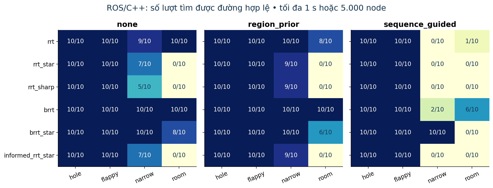
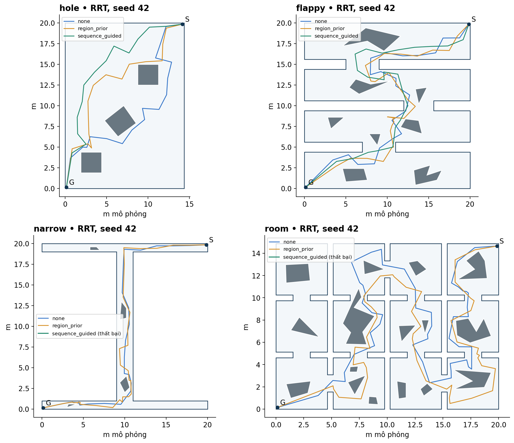

# Benchmark ROS/C++ trên GCR-Dataset

Ngày chạy: 08/10/2026. Đây là phần bổ sung ROS cho báo cáo Python trước đó. Đã chạy trực tiếp executable `path_finder` được biên dịch từ bản DACN-main hiện tại trong container ROS Noetic.

Đã hoàn tất **720/720 lượt**, **536 lượt tìm được đường**, 184 lượt không tìm được trong ngân sách, không có lỗi hạ tầng/thu log. Đã kiểm tra độc lập toàn bộ 536 đường thành công bằng Shapely: đúng start/goal, nằm trong mặt phẳng z=0, mọi đoạn đạt clearance 0,15 m và chiều dài khớp log trong sai số làm tròn dưới 1 mm. Hai bộ GTest có **24 test case**, đều qua; con số 48 do `catkin_test_results` in ra đếm cả mức tổng XML và suite, không phải 48 test riêng.

## Những điểm đáng chú ý

Trên hole và flappy, cả ba chế độ đều đạt 10/10 cho sáu planner. Vì vậy cần xem chiều dài và thời gian tới lời giải đầu để phân biệt, không chỉ tỷ lệ thành công. Trên narrow, region_prior cải thiện RRT# từ 5/10 lên 9/10, RRT* và Informed RRT* từ 7/10 lên 9/10. Tuy nhiên trên room, RRT giảm từ 10/10 xuống 8/10 và BRRT* từ 8/10 xuống 6/10 khi dùng prior này. LLM không cải thiện đồng đều trên mọi map.

Sequence_guided rất kém ở narrow và room trong cấu hình đã chạy; riêng narrow có bốn planner đạt 0/10. Kết quả này phù hợp với việc sequence được chọn chưa được xác thực về tính khả thi hình học trong báo cáo trước, nhưng chưa tách riêng được nguyên nhân do sequence, trọng số, portal hay ngân sách. Không dùng kết quả này để khẳng định mọi phương pháp hướng dẫn theo sequence đều kém.

## Điều kiện chạy

- 4 map: hole, flappy, narrow, room; 6 planner: RRT, RRT*, RRT#, BRRT, BRRT*, Informed RRT*.
- Mỗi cặp map/planner chạy none, region_prior và sequence_guided; 10 seed từ 42 đến 51. Tổng 4×6×3×10=720.
- Giới hạn mỗi lượt **1 giây hoặc 5.000 node**, dừng theo điều kiện thuật toán. Nhiều lượt chạm giới hạn node trước 1 giây. Kiểm tra ngân sách thời gian ở đầu vòng lặp nên một vòng lặp cuối có thể làm thời gian hơi vượt 1 giây.
- Theo mặc định test_planners.launch: steer_length=2 m; search_radius=6 m ở planner dùng tham số này; planar=true; step_mode=false; không chạy RViz. BRRT không có cùng cơ chế search_radius như RRT*.
- Dùng C++ gốc, không chỉnh thuật toán. Runner giữ một ROS master riêng, khởi tạo node C++ mới cho từng lượt, dùng tham số của launch file rồi gửi goal từ map. Chạy tuần tự, xen kẽ các chế độ trong mỗi seed để giảm lệch thứ tự.
- ROS Noetic, Ubuntu 20.04.6, aarch64, GCC 9.4.0, build Release/O3; Docker trên máy người dùng. Thời gian đo không phải bảo đảm thời gian thực và có thể đổi theo tải máy.
- Cùng map, start/goal, bán kính robot 0,10 m và margin 0,05 m như nghiên cứu Python; cạnh dài nhất giả định 20 m. Collision C++ dùng khoảng cách polygon chính xác trên toàn đoạn, không dựa vào độ phân giải voxel 0,2 m dành cho hiển thị.

Không gọi lại LLM trong đợt này. Dùng nguyên điểm đã lưu từ model nvidia/nemotron-3-super-120b-a12b:free, kiểm tra hash đầu vào. Thời gian API tạo prior ban đầu **không tính** trong thời gian planner dưới đây.

## Ý nghĩa các chế độ

**none:** không thêm hướng dẫn vùng. Informed RRT* vẫn dùng informed sampling nội tại sau khi có lời giải; “none” không có nghĩa tắt đặc tính thuật toán đó.

**region_prior:** chọn vùng theo điểm LLM rồi lấy mẫu đều trong vùng. Với Informed RRT*, sau khi có lời giải, prior được điều kiện hóa vào ellipsoid cải thiện theo code hiện tại.

**sequence_guided:** chọn sequence bằng điểm vùng LLM kết hợp cost cạnh hình học; 80% nhánh lấy mẫu được hướng dẫn và 20% lấy mẫu global. Trong nhánh guided, xác suất lấy tại portal là 20%, còn lại lấy trong vùng thuộc sequence. Đây không phải khóa cứng vào corridor, cũng không ép cây đi đúng thứ tự vùng. Thứ tự xử lý trong sampler hiện tại ưu tiên sequence_guided trước informed, nên cặp Informed RRT*/sequence_guided không áp cùng phép lọc ellipsoid như region_prior. Diễn giải kết quả theo đúng cấu hình này.

Điểm LLM là prior cố định cho mỗi map, không phải bảo đảm an toàn hay xác suất thành công. Nhiều seed planner chưa thay thế cho việc thử nhiều prior do LLM sinh độc lập.

## Tỷ lệ thành công

Map | Planner | none | LLM region_prior | sequence_guided
--- | --- | --- | --- | ---
hole | rrt | 10/10 | 10/10 | 10/10
hole | rrt_star | 10/10 | 10/10 | 10/10
hole | rrt_sharp | 10/10 | 10/10 | 10/10
hole | brrt | 10/10 | 10/10 | 10/10
hole | brrt_star | 10/10 | 10/10 | 10/10
hole | informed_rrt_star | 10/10 | 10/10 | 10/10
flappy | rrt | 10/10 | 10/10 | 10/10
flappy | rrt_star | 10/10 | 10/10 | 10/10
flappy | rrt_sharp | 10/10 | 10/10 | 10/10
flappy | brrt | 10/10 | 10/10 | 10/10
flappy | brrt_star | 10/10 | 10/10 | 10/10
flappy | informed_rrt_star | 10/10 | 10/10 | 10/10
narrow | rrt | 9/10 | 10/10 | 0/10
narrow | rrt_star | 7/10 | 9/10 | 0/10
narrow | rrt_sharp | 5/10 | 9/10 | 0/10
narrow | brrt | 10/10 | 10/10 | 2/10
narrow | brrt_star | 10/10 | 10/10 | 10/10
narrow | informed_rrt_star | 7/10 | 9/10 | 0/10
room | rrt | 10/10 | 8/10 | 1/10
room | rrt_star | 0/10 | 0/10 | 0/10
room | rrt_sharp | 0/10 | 0/10 | 0/10
room | brrt | 10/10 | 10/10 | 6/10
room | brrt_star | 8/10 | 6/10 | 0/10
room | informed_rrt_star | 0/10 | 0/10 | 0/10

## Chiều dài và độ trễ

Chiều dài và thời gian tới lời giải đầu chỉ tính những lượt thành công; đọc kèm tỷ lệ thành công. Thời gian planner tính cả lượt thất bại, loại thời gian khởi động node, thu topic và tạo prior LLM. SD là độ lệch chuẩn giữa các seed, không phải khoảng tin cậy. Không kết luận một chế độ tốt hơn chỉ vì trung bình trên ít lượt thành công hơn.

Map | Planner | Mode | Thành công | L TB ± SD (m) | Tới lời giải đầu TB (ms) | Planner TB (ms) | Node TB
--- | --- | --- | --- | --- | --- | --- | ---
hole | rrt | none | 10/10 | 30.07 ± 1.72 | 0.54 | 29.62 | 4998
hole | rrt | region_prior | 10/10 | 30.68 ± 1.83 | 0.42 | 31.95 | 4998
hole | rrt | sequence_guided | 10/10 | 29.27 ± 1.38 | 0.30 | 31.07 | 4998
hole | rrt_star | none | 10/10 | 24.57 ± 0.01 | 1.28 | 364.91 | 4998
hole | rrt_star | region_prior | 10/10 | 24.58 ± 0.01 | 0.89 | 451.19 | 4998
hole | rrt_star | sequence_guided | 10/10 | 24.56 ± 0.00 | 0.74 | 416.30 | 4998
hole | rrt_sharp | none | 10/10 | 24.56 ± 0.00 | 1.49 | 1000.16 | 2246
hole | rrt_sharp | region_prior | 10/10 | 24.57 ± 0.00 | 0.93 | 1004.58 | 1803
hole | rrt_sharp | sequence_guided | 10/10 | 24.56 ± 0.00 | 0.55 | 1018.89 | 2124
hole | brrt | none | 10/10 | 27.90 ± 1.92 | 0.20 | 44.80 | 4998
hole | brrt | region_prior | 10/10 | 27.26 ± 1.14 | 0.19 | 46.49 | 4998
hole | brrt | sequence_guided | 10/10 | 26.40 ± 0.88 | 0.11 | 47.82 | 4998
hole | brrt_star | none | 10/10 | 24.56 ± 0.00 | 0.19 | 1000.18 | 2136
hole | brrt_star | region_prior | 10/10 | 24.58 ± 0.01 | 0.52 | 1000.21 | 1922
hole | brrt_star | sequence_guided | 10/10 | 24.56 ± 0.00 | 0.27 | 1000.17 | 2355
hole | informed_rrt_star | none | 10/10 | 24.56 ± 0.00 | 1.34 | 1000.43 | 3734
hole | informed_rrt_star | region_prior | 10/10 | 24.57 ± 0.01 | 0.81 | 1000.43 | 3974
hole | informed_rrt_star | sequence_guided | 10/10 | 24.56 ± 0.00 | 0.57 | 408.39 | 4998
flappy | rrt | none | 10/10 | 45.45 ± 5.61 | 5.05 | 73.25 | 4998
flappy | rrt | region_prior | 10/10 | 44.53 ± 2.27 | 5.67 | 72.02 | 4998
flappy | rrt | sequence_guided | 10/10 | 43.58 ± 2.45 | 4.62 | 72.09 | 4998
flappy | rrt_star | none | 10/10 | 35.31 ± 0.12 | 17.52 | 1000.26 | 2890
flappy | rrt_star | region_prior | 10/10 | 35.18 ± 0.15 | 25.98 | 1000.42 | 2677
flappy | rrt_star | sequence_guided | 10/10 | 35.04 ± 0.08 | 19.82 | 1000.65 | 2733
flappy | rrt_sharp | none | 10/10 | 35.27 ± 0.10 | 20.56 | 1003.62 | 1572
flappy | rrt_sharp | region_prior | 10/10 | 35.17 ± 0.15 | 28.49 | 1003.19 | 1254
flappy | rrt_sharp | sequence_guided | 10/10 | 35.05 ± 0.08 | 23.14 | 1003.71 | 1312
flappy | brrt | none | 10/10 | 45.18 ± 3.76 | 2.95 | 113.21 | 4998
flappy | brrt | region_prior | 10/10 | 42.80 ± 2.60 | 3.24 | 114.12 | 4998
flappy | brrt | sequence_guided | 10/10 | 43.60 ± 2.94 | 1.77 | 108.54 | 4998
flappy | brrt_star | none | 10/10 | 35.38 ± 0.15 | 6.63 | 1000.37 | 2483
flappy | brrt_star | region_prior | 10/10 | 35.21 ± 0.14 | 14.78 | 1000.47 | 2210
flappy | brrt_star | sequence_guided | 10/10 | 35.05 ± 0.07 | 5.41 | 1000.48 | 2301
flappy | informed_rrt_star | none | 10/10 | 35.35 ± 0.12 | 17.58 | 1000.81 | 2590
flappy | informed_rrt_star | region_prior | 10/10 | 35.17 ± 0.15 | 26.20 | 1000.53 | 2611
flappy | informed_rrt_star | sequence_guided | 10/10 | 35.04 ± 0.08 | 20.58 | 1000.55 | 2741
narrow | rrt | none | 9/10 | 41.17 ± 2.38 | 24.19 | 49.21 | 4998
narrow | rrt | region_prior | 10/10 | 40.55 ± 1.32 | 9.57 | 39.16 | 4998
narrow | rrt | sequence_guided | 0/10 | — ± — | — | 38.65 | 4998
narrow | rrt_star | none | 7/10 | 36.50 ± 0.05 | 373.18 | 1000.25 | 3914
narrow | rrt_star | region_prior | 9/10 | 36.61 ± 0.07 | 94.31 | 1000.33 | 3435
narrow | rrt_star | sequence_guided | 0/10 | — ± — | — | 1000.34 | 3876
narrow | rrt_sharp | none | 5/10 | 36.53 ± 0.06 | 357.56 | 1000.34 | 2768
narrow | rrt_sharp | region_prior | 9/10 | 36.71 ± 0.08 | 185.22 | 1063.79 | 2054
narrow | rrt_sharp | sequence_guided | 0/10 | — ± — | — | 1001.65 | 2798
narrow | brrt | none | 10/10 | 40.35 ± 1.35 | 5.75 | 69.36 | 4998
narrow | brrt | region_prior | 10/10 | 40.20 ± 0.98 | 4.95 | 62.22 | 4998
narrow | brrt | sequence_guided | 2/10 | 39.36 ± 0.41 | 15.78 | 62.10 | 4998
narrow | brrt_star | none | 10/10 | 36.51 ± 0.05 | 7.18 | 1000.25 | 3631
narrow | brrt_star | region_prior | 10/10 | 36.60 ± 0.07 | 2.64 | 1000.25 | 3321
narrow | brrt_star | sequence_guided | 10/10 | 36.63 ± 0.19 | 16.89 | 1000.43 | 3865
narrow | informed_rrt_star | none | 7/10 | 36.50 ± 0.04 | 375.04 | 1000.34 | 3764
narrow | informed_rrt_star | region_prior | 9/10 | 36.61 ± 0.07 | 94.72 | 1000.43 | 3364
narrow | informed_rrt_star | sequence_guided | 0/10 | — ± — | — | 1000.38 | 3871
room | rrt | none | 10/10 | 63.35 ± 3.08 | 126.53 | 216.14 | 4998
room | rrt | region_prior | 8/10 | 61.92 ± 3.51 | 181.71 | 249.41 | 4998
room | rrt | sequence_guided | 1/10 | 52.21 ± 0.00 | 164.17 | 204.07 | 4998
room | rrt_star | none | 0/10 | — ± — | — | 1001.08 | 846
room | rrt_star | region_prior | 0/10 | — ± — | — | 1001.43 | 749
room | rrt_star | sequence_guided | 0/10 | — ± — | — | 1001.49 | 653
room | rrt_sharp | none | 0/10 | — ± — | — | 1008.70 | 717
room | rrt_sharp | region_prior | 0/10 | — ± — | — | 1003.09 | 651
room | rrt_sharp | sequence_guided | 0/10 | — ± — | — | 1012.79 | 525
room | brrt | none | 10/10 | 60.96 ± 3.89 | 110.54 | 327.13 | 4998
room | brrt | region_prior | 10/10 | 61.98 ± 6.45 | 108.63 | 332.55 | 4998
room | brrt | sequence_guided | 6/10 | 57.84 ± 4.71 | 196.59 | 345.01 | 4998
room | brrt_star | none | 8/10 | 45.75 ± 0.48 | 376.29 | 1000.72 | 1048
room | brrt_star | region_prior | 6/10 | 48.18 ± 3.66 | 631.86 | 1001.09 | 991
room | brrt_star | sequence_guided | 0/10 | — ± — | — | 1001.66 | 875
room | informed_rrt_star | none | 0/10 | — ± — | — | 1000.88 | 848
room | informed_rrt_star | region_prior | 0/10 | — ± — | — | 1001.06 | 743
room | informed_rrt_star | sequence_guided | 0/10 | — ± — | — | 1000.98 | 652

## So sánh theo cặp none và LLM

Chỉ so sánh đường ở những seed cả hai chế độ thành công. ΔL=100×(L_LLM/L_none−1), âm nghĩa là LLM ngắn hơn. Lấy trung bình ΔL từng cặp, không lấy tỷ số của hai trung bình. Overlap gồm Jaccard tập vùng đi qua, LCS chuỗi vùng có thứ tự và độ phủ chiều dài đối xứng trong dải cách đường kia 0,2 m. Khi không có cặp thành công ghi —, không gán 0%.

Map | Planner | Cặp/10 | ΔL (%) | Jaccard vùng (%) | LCS (%) | Độ phủ đường (%)
--- | --- | --- | --- | --- | --- | ---
hole | rrt | 10 | 2.44 | 49.90 | 56.08 | 11.75
hole | rrt_star | 10 | 0.05 | 100.00 | 100.00 | 100.00
hole | rrt_sharp | 10 | 0.03 | 100.00 | 100.00 | 100.00
hole | brrt | 10 | -2.02 | 77.00 | 80.62 | 28.67
hole | brrt_star | 10 | 0.04 | 100.00 | 100.00 | 100.00
hole | informed_rrt_star | 10 | 0.03 | 100.00 | 100.00 | 100.00
flappy | rrt | 10 | -0.51 | 80.68 | 84.52 | 32.67
flappy | rrt_star | 10 | -0.38 | 100.00 | 100.00 | 94.18
flappy | rrt_sharp | 10 | -0.27 | 100.00 | 100.00 | 97.14
flappy | brrt | 10 | -4.71 | 83.69 | 85.72 | 33.65
flappy | brrt_star | 10 | -0.49 | 100.00 | 100.00 | 89.79
flappy | informed_rrt_star | 10 | -0.49 | 100.00 | 100.00 | 97.13
narrow | rrt | 9 | -1.08 | 83.88 | 80.55 | 53.29
narrow | rrt_star | 6 | 0.27 | 100.00 | 100.00 | 100.00
narrow | rrt_sharp | 4 | 0.54 | 100.00 | 100.00 | 98.89
narrow | brrt | 10 | -0.29 | 78.95 | 74.61 | 45.20
narrow | brrt_star | 10 | 0.26 | 100.00 | 100.00 | 99.15
narrow | informed_rrt_star | 6 | 0.26 | 100.00 | 100.00 | 100.00
room | rrt | 8 | -2.22 | 68.22 | 73.06 | 39.19
room | rrt_star | 0 | — | — | — | —
room | rrt_sharp | 0 | — | — | — | —
room | brrt | 10 | 1.87 | 69.45 | 73.47 | 38.91
room | brrt_star | 4 | 0.27 | 93.47 | 95.18 | 81.40
room | informed_rrt_star | 0 | — | — | — | —

Không tổng hợp overlap cây khám phá trong bảng này: topic marker cây không được xuất/thu đủ ở mọi lượt. File cây đã thu được giữ trong results/trees để kiểm tra, không dùng số lượng mẫu thu thiếu làm số vùng khám phá. Toàn bộ đường cuối của các lượt thành công đã được thu đủ.

## Đường đi thực từ ROS

Các đường trên hình lấy từ nav_msgs/Path của RRT seed 42; không lấy lại từ chương trình Python. Chế độ thất bại được ghi trong chú giải và không vẽ đường giả.

## Đối chiếu với nghiên cứu Python

Hai bộ kết quả trả lời các câu hỏi khác nhau, không thể so trực tiếp thời gian hoặc tỷ lệ thành công như thể cùng một thuật toán/cấu hình. Python dùng một RRT thử nghiệm, 2.500 bước, steer=0,7 m, nối goal trong 1,4 m. ROS dùng sáu implementation C++, thời gian/node budget và tham số nêu trên. RNG, quy tắc mở rộng/kết nối, rewiring và điều kiện dừng cũng khác. Vì vậy một seed Python thất bại nhưng ROS thành công không phải mâu thuẫn.

Kết quả sequence_guided cũng không chứng minh corridor chứa đường tối ưu: sampler còn nhánh global và không ràng buộc thứ tự. Đường được trả về là đường tốt nhất mà implementation giữ trong ngân sách; chưa chứng minh tối ưu liên tục.

## Thay đổi để thực hiện benchmark

Đã sửa parser benchmark để loại mã màu ANSI trước khi đọc RESULT và trả về “chưa có bản ghi hợp lệ” với trường số lỗi. Lỗi được tái hiện bằng log ROS thật, kèm regression test. Runner mới chỉ điều phối node và thu dữ liệu; không thay đổi code thuật toán C++.

File kiểm chứng: results/benchmark.json (mọi lượt và tổng hợp), comparison.json (overlap theo seed), verification.json (kiểm tra hình học độc lập), input_hashes.json, source_hashes.json, build.log và cpp-tests/*.xml. Mỗi lượt có log riêng; các request API không xuất hiện trong đợt benchmark này.

Xem RUNBOOK.md để chạy lại. Kết quả là 10 seed/map/cấu hình trên một máy và một prior LLM/map. Cần thêm prior và seed trước khi khẳng định mức cải thiện có ý nghĩa thống kê.
