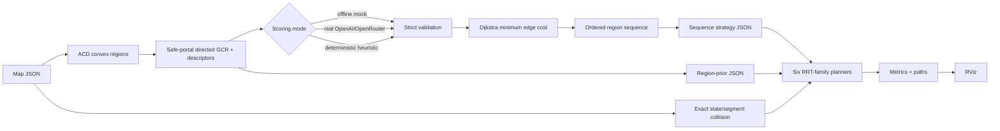
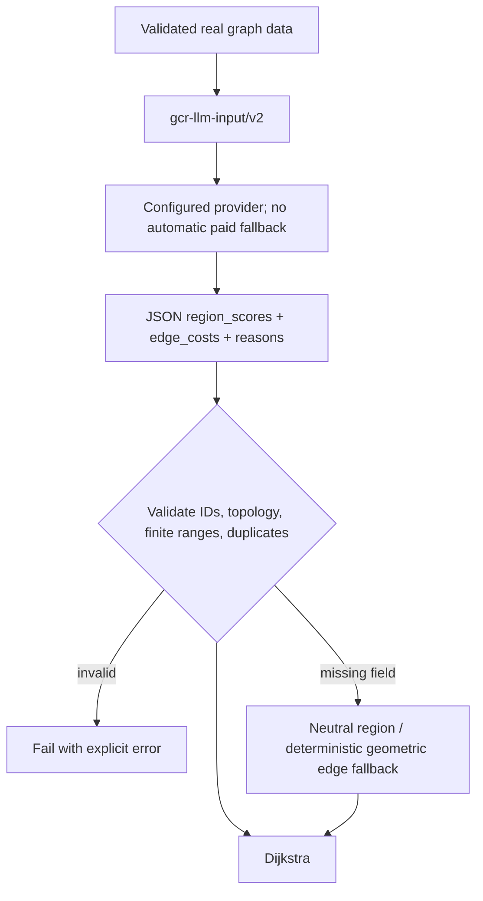
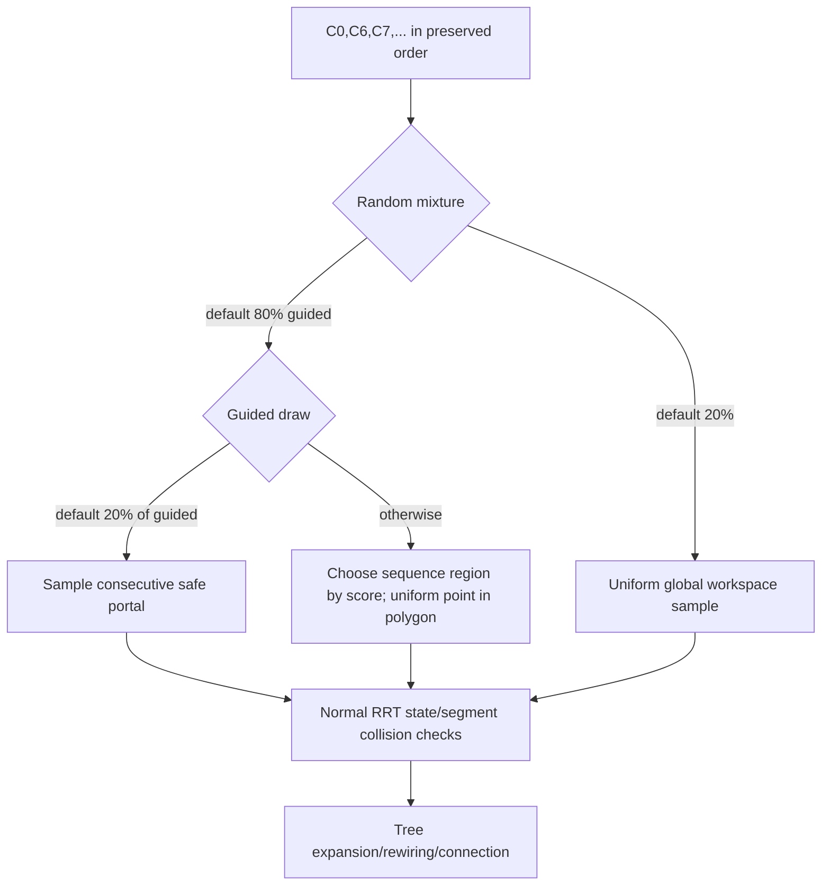

# Kiến trúc đã triển khai

## Toàn pipeline

## LLM scoring

## Sequence thành sampling

Sequence chỉ thay đổi proposal distribution. Dijkstra success không được dùng làm RRT success; final path vẫn phải có đúng start/goal và mọi segment phải qua `OccMap::checkSegment`.

## Input/output module

| Module | Input | Output |
|---|---|---|
| `build_graph.py` | map hoặc convex regions JSON | directed safe graph, descriptors, SVG |
| `llm_region_planner.py` | graph + mock/real/heuristic mode | validated plan, route, sampling prior, SVG |
| `scoring.py` | validated graph/start/goal | deterministic scores/costs with contributions |
| `export_sampling_corridor.py` | graph + validated plan/prior | ordered sequence-guided strategy |
| `convex_corridor.h` | prior/strategy JSON | strict C++ structs |
| `BiasSampler` | selected guidance mode | candidate sample only |
| `OccMap/MapGeometry2D` | map + candidate state/segment | exact valid/invalid decision |
| RRT/RRT*/RRT#/BRRT/BRRT*/Informed RRT* | samples + collision oracle | tree, path, real metrics |
| `benchmark.py` | same inputs/budget/seeds | per-run JSON/CSV + aggregate statistics |

## Point robot và obstacle inflation

Planner dùng configuration space: robot được coi là một reference point; forbidden set là obstacle giãn ra và workspace co vào một khoảng `robot_radius + safety_margin`. Code không dựng polygon offset mới mà kiểm tra chính xác tương đương bằng khoảng cách point/segment tới obstacle và boundary. Vì vậy không inflation hai lần. Python dùng cùng tổng clearance để kiểm tra start/goal và trim portal; C++ dùng tổng đó cho mọi state/segment. Sample có thể rơi gần obstacle nhưng sẽ bị collision checker loại, không được thêm vào tree.

