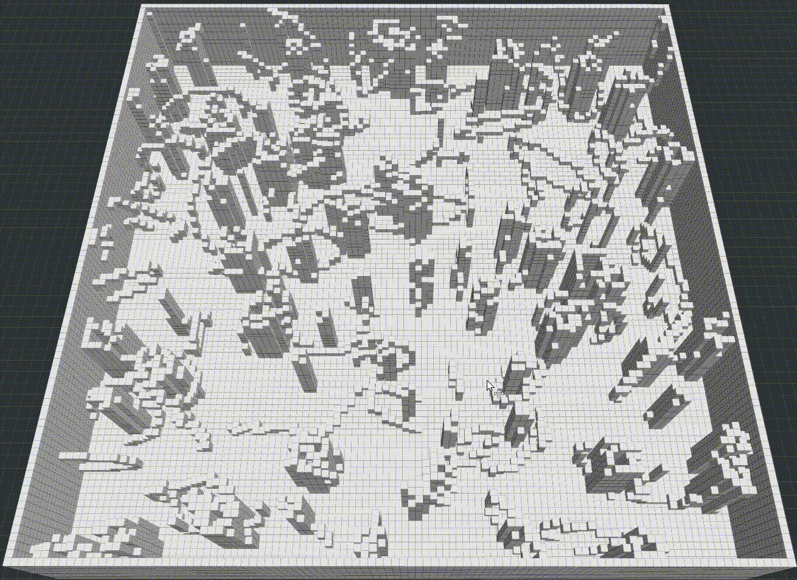
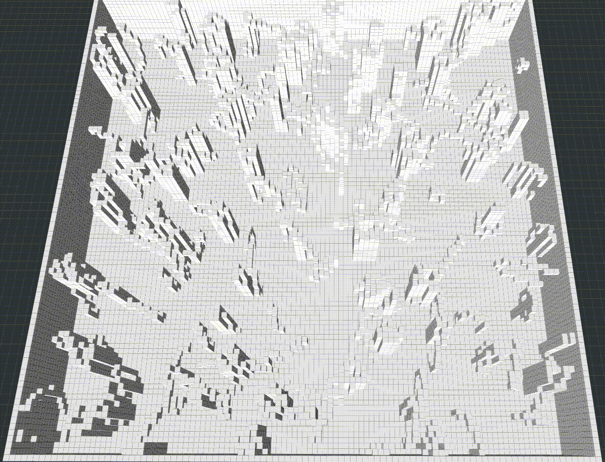

# C++ implementation and visualization of some sampling-based path planners

## Build & Run
### Build
1. git clone git@github.com:ZJU-FAST-Lab/sampling-based-path-finding.git
2. cd sampling-based-path-finding/
3. catkin_make

### Run
In two seperate terminals, _source_ first, then:
1. roslaunch path_finder rviz.launch
2. roslaunch path_finder test_planners.launch

In Rviz panel, add a new tool "Goal3DTool", press keyboard "g" and use mouse to set goals.

## LLM-guided sampling integration

`guidance_mode` selects exactly one sampling source for RRT, RRT*, RRT#, BRRT,
and BRRT*:

- `none`: original uniform/informed/GUILD behavior.
- `corridor`: legacy hard guidance. Edge weights and Dijkstra choose a route;
  samples are restricted to its polygons and weighted uniformly by corridor
  area. Start and goal must be in the first and last route regions.
- `region_prior`: primary LLM-Guided Region Prior architecture. All graph
  regions remain available. A region is selected with probability
  `score_i / sum(scores)`, then a point is sampled uniformly by area inside
  that polygon. Start and goal may lie in any supplied region.

Both guided modes set every sample z to the current planner start z. Neither
mode falls back to global-map sampling when its configured file is missing or
invalid. Existing state/segment collision checks, nearest-neighbor behavior,
tree expansion, rewiring, and geometric path-length costs are unchanged.

The shared `BiasSampler` triangulates each convex polygon as a fan and samples
the selected triangle with uniform barycentric coordinates. Boundary points
count as inside during endpoint validation.

Boost.PropertyTree is used only to load the small JSON artifact. On Ubuntu/ROS,
install the normal Boost development package if it is not already present:

```bash
sudo apt install libboost-dev
```

### Region-prior workflow

From the directory containing the two sibling repositories:

```bash
cd convex-region-graph
python3 llm_region_prior.py graph.json \
  --start C0 \
  --goal C6 \
  --provider openrouter \
  --output outputs/region_prior.json

python3 export_sampling_prior.py \
  --graph graph.json \
  --prior outputs/region_prior.json \
  --output outputs/sampling_prior.json

cd ../sampling-based-path-finding-main
catkin_make
source devel/setup.bash
roslaunch path_finder rviz.launch
```

In a second sourced terminal:

```bash
cd sampling-based-path-finding-main
source devel/setup.bash
roslaunch path_finder test_planners.launch \
  guidance_mode:=region_prior \
  sampling_prior_file:=$(realpath ../convex-region-graph/outputs/sampling_prior.json)
```

The launch file enables `region_prior` by default and resolves the sibling
artifact automatically. It initializes the demo at the C0 centroid; set the
RViz goal inside any supplied region, such as C6 at x=6.5, y=1.0, z=0.0.

### Hard corridor workflow

The existing edge-weight/Dijkstra path remains available:

```bash
cd convex-region-graph
python3 llm_planner.py graph.json \
  --start C0 --goal C6 --provider openrouter \
  --weights-output outputs/llm_weights.json \
  --route-output outputs/route.json \
  --svg-output outputs/route.svg
python3 export_sampling_corridor.py \
  --graph graph.json \
  --route outputs/route.json \
  --output outputs/sampling_corridor.json

cd ../sampling-based-path-finding-main
source devel/setup.bash
roslaunch path_finder test_planners.launch \
  guidance_mode:=corridor \
  corridor_file:=$(realpath ../convex-region-graph/outputs/sampling_corridor.json)
```

Use `guidance_mode:=none` for the original planner comparison. Older direct
node configurations that omit `guidance_mode` and set
`use_convex_corridor:=true` are still recognized for compatibility.

Run the non-ROS adapter tests from `convex-region-graph` with:

```bash
python3 -m unittest discover -v
```

Run the sampler geometry/stochastic tests on the ROS machine with:

```bash
cd sampling-based-path-finding-main
catkin_make run_tests_path_finder
catkin_test_results
```

## RRT
_LaValle, S.M. (1998). Rapidly-exploring random trees : a new tool for path planning. The annual research report_.
<p align="center">
  
</p>

## RRT*
### Original

_Karaman, Sertac, and Emilio Frazzoli. “Sampling-Based Algorithms for Optimal Motion Planning.” The International Journal of Robotics Research, vol. 30, no. 7, June 2011, pp. 846–894, doi:10.1177/0278364911406761_.
<p align="center">
  
</p>

### RRT* with informed sampling

_J. D. Gammell, T. D. Barfoot and S. S. Srinivasa, "Informed Sampling for Asymptotically Optimal Path Planning," in IEEE Transactions on Robotics, vol. 34, no. 4, pp. 966-984, Aug. 2018, doi: 10.1109/TRO.2018.2830331_.
<p align="center">
  
</p>

### RRT* with GUILD sampling

_Aditya Mandalika and Rosario Scalise and Brian Hou and Sanjiban Choudhury and Siddhartha S. Srinivasa, Guided Incremental Local Densification for Accelerated Sampling-based Motion Planning," in Arxiv, 2021, https://arxiv.org/abs/2104.05037_
<p align="center">
  
</p>

## RRT#
### Original

_O. Arslan and P. Tsiotras, "Use of relaxation methods in sampling-based algorithms for optimal motion planning," 2013 IEEE International Conference on Robotics and Automation, 2013, pp. 2421-2428, doi: 10.1109/ICRA.2013.6630906_.
<p align="center">
  
</p>

### RRT# with informed sampling
<p align="center">
  
</p>

### RRT# with GUILD sampling
<p align="center">
  
</p>

## Bidirectional RRT
### RRT-connect (BRRT)

_Kuffner, James J., and Steven M. LaValle. "RRT-connect: An efficient approach to single-query path planning." Proceedings 2000 ICRA._
<p align="center">
  
</p>

### IB-RRT*

_Qureshi, Ahmed Hussain, and Yasar Ayaz. "Intelligent bidirectional rapidly-exploring random trees for optimal motion planning in complex cluttered environments." Robotics and Autonomous Systems 68 (2015): 1-11._

<p align="center">
  
</p>

### IB-RRT* with informed sampling

<p align="center">
  
</p>
